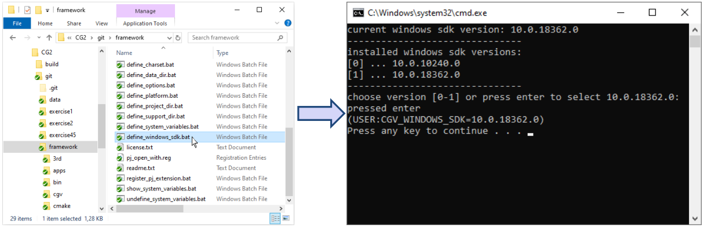
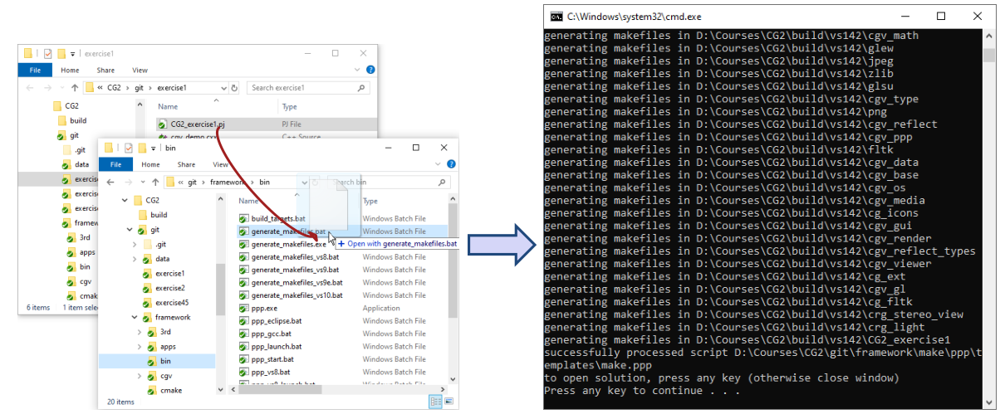
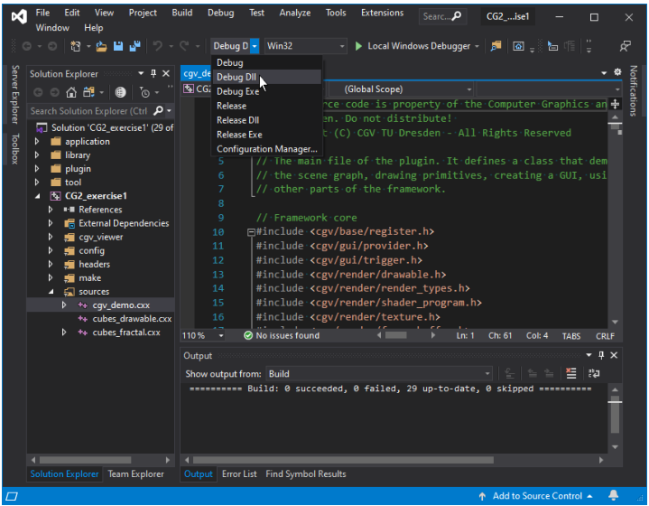

# Computer Graphics 2 - exercise repository

This repository contains the code which you are going to work with over the
course of the CG2 exercises. It contains the CGV Framework as a submodule, so be
sure to clone the repository using the `--recursive` flag, like so:

```bash
git clone https://bitbucket.org/cgvtud/cg2.git --recursive
```

If you forget adding the flag when cloning, you can run

```bash
git submodule init
git submodule update --remote
```

from within your local repository root later on.

## Development environment

The CGV Framework is cross-platform and supports Windows and Linux (MacOS is
supported in theory, but completely untested and likely to not work without
adjustments). For the exercise however, only building on Windows and Visual
Studio is officially supported. CMake build files are included in the exercise
and you are free to develop on the OS of your choice, but due to the vast
multitude of different configurations and setups, we _cannot_ and _*will not*_
provide assistance if you encounter trouble building or running on anything
other than Windows.

## Building the exercises

Advanced users may opt to build with CMake. An alternative approach is to use the CGV framework's own makefile generator.

### Using CMake

Start by navigating to the project's directory:

```bash
cd cg2
```

Using Visual Studio 2022 (recommended and tested), initialize and generate the
solution with:

```bash
cmake -B cmake-build -G "Visual Studio 17 2022"
```

For other supported versions (e.g., Visual Studio 2019), modify the generator
flag appropriately:

```bash
cmake -B cmake-build -G "Visual Studio 16 2019"
```

Be advised that not all versions of Visual Studio are supported. Tested versions
are 2022 and 2019.

Once configured, open `CG2.sln` in the `cmake-build` directory. 

On the right side (in the Solution Explorer), you will see a list of projects.
Right-click on the project you want to build and select 'Set as StartUp
Project'. Then either press `F5` or click on the green play button to build and
run the project.

If you want to change the project you are working on, you can once again
right-click on the project and select 'Set as StartUp Project'.

---

### Using builtin CGV build tool

#### Setting up the environment

+ Navigate to the directory `cgv` in the repository root
+ You will find several windows batch scripts which take care of the setup
+ First, you have to select which of the installed Windows SDKs to use
+ Hitting enter in the command prompt will choose the newest one



#### Generate the Visual Studio solution

+ The Framework is now set up – next, we generate a VS solution for exercise 1
+ For this, it’s easiest if you open two explorer windows
+ one should show the folder `exercise1` from the repository root
+ the other the folder `framework\bin`
+ Drag the "project file" `CG2_exercise1.pj` onto the batch script `generate_makefiles.bat`



#### Build the code

+ If you hit any key in the previous console window, Visual Studio will open automatically.
+ Otherwise, you can find your solution inside your build folder; e.g. `build\vs142\CG2_exercise1` in case of Visual Studio 2019 and 32-bit builds
+ Before you build the code, make sure either of the two "... Dll" configurations is selected
	+ The other two build types ("Debug/Release" and "Debug/Release Exe") are for advanced usage and outside of the scope of the exercise
+ Done! You can now build the solution.



## Linux pointers

### Prerequisites
To build the CGV Framework under Linux, several development packages related to
OpenGL and low-level input device access are required. On Debian-based
distributions, those are `libgl1-mesa-dev libxi-dev libxinerama-dev libglut-dev`
(or `freeglut3-dev`, for the later) as well as their respective dependencies, which should get
pulled in automatically.

### IDE

To solve the exercise in a productive way under Linux, we do recommend using an
IDE. Many current offerings (like the open source Visual Studio Code editor)
support opening a CMake-enabled source tree directly. Currently, the Framework
CMake build system will automatically generate launch and debug configurations
for VS Code and JetBrains IDEA/CLion. But if you use any other IDE, you'll have
to create launch/debug configs yourself. Shell scripts for launching the exercises
will be created in your chosen CMake build directory, named `run_CG2_exercise1.sh`,
`run_CG2_exercise2.sh` and `run_CG2_exercise45.sh`, respectively. You can
inspect them to find out how to launch the `cgv_viewer` binary and provide it
with the necessary command line arguments for each exercise, which you can then
adapt for your IDE.